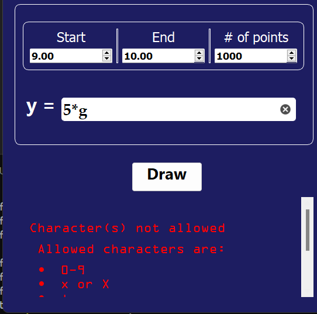

<h1><span style="color:blue">Master_Micro_Function_Plotter</span></h1>


<h2><i>a Python GUI program that plots an arbitrary user-entered function</i><h2>
</br>

## Description
Function Plotter is a Python GUI program that plots an arbitrary user-entered function. The program is written in Python and uses the PySide2 library for the GUI. The program is designed to be user-friendly and easy to use. The user can enter a function in the text box with start , end and number of points then the program will plot it.

## Screenshots
- ### Working Examples
    - Function of x
        
    - Constant
        
- ### Errors
  - Empty Text Box
  - 
     
  - Allowed Characters
  - 
    
       
  - Paranthesis Error
  - 
    
  
  - Wrong Function
  - 
    

- ### Testing (31 total tests)
    
    

## Technologies Used
- Python
- PySide2
- Matplotlib
- Numpy

## Run in command prompt
<ol>
<li>Clone the repository</li>

```bash
git clone https://github.com/ahmedsaad562000/Master_Micro_Function_Plotter.git
```

<li>Create Virtual Environment</li>

```bash
python -m venv path/to/new/virtual/environment
```
<li>Activate Your virtual Environment</li>

- cmd
  
```bash
path/to/new/virtual/environment/Scripts/activate
```
- powershell

```bash
. path/to/new/virtual/environment/Scripts/Activate.ps1
```

<li>Install Requirements</li>

```bash
pip install -r requirements.txt
```

<li>Run the program</li>

```bash
python -m src
```

</ol>